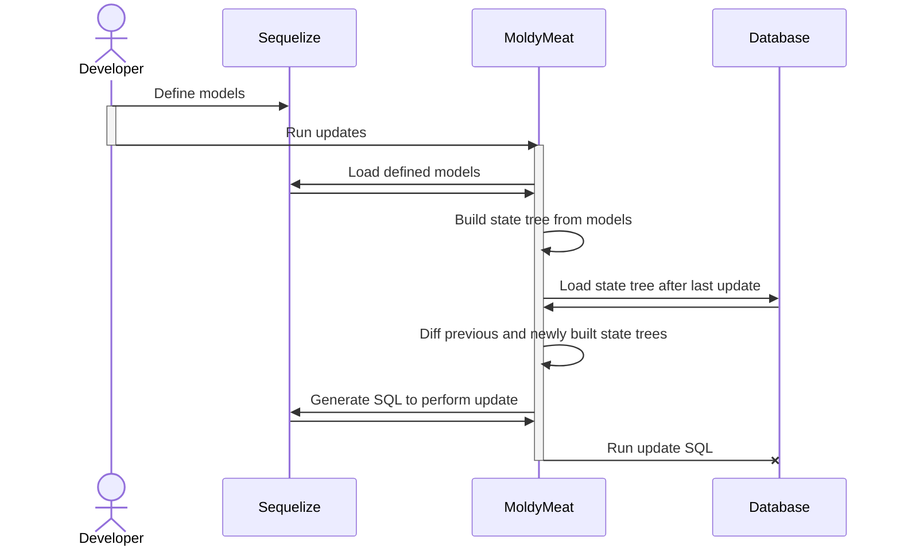

# MoldyMeat

Effortlessly keep your database's tables in sync with your Sequelize models.

## Rationale

Migrations should be a thing of the past. Here's why:

1. They waste programmer-hours to debug when they break
2. Depending on the framework, they have to be hand-written (violating DRY)
3. As migrations accumulate, they lose efficience and become a liability that can stymie shipping new code

## Usage

MoldyMeat is a simple library that doesn't take any options and Just Works (tm). Here's how to use it:

```javascript
const sequelize = /* create your Sequelize instance */;

const Model = sequelize.define(...);
const AnotherModel = sequelize.define(...);
// ...more models

const moldyMeat = new MoldyMeat({sequelize});
await moldyMeat.initialize();
await moldyMeat.updateSchema();

// Now, you do that voodoo that you do so well
```

After calling `moldyMeat.updateSchema()`, you are able to use your models as if you had written and ran migrations for them.

## Internal Architecture


