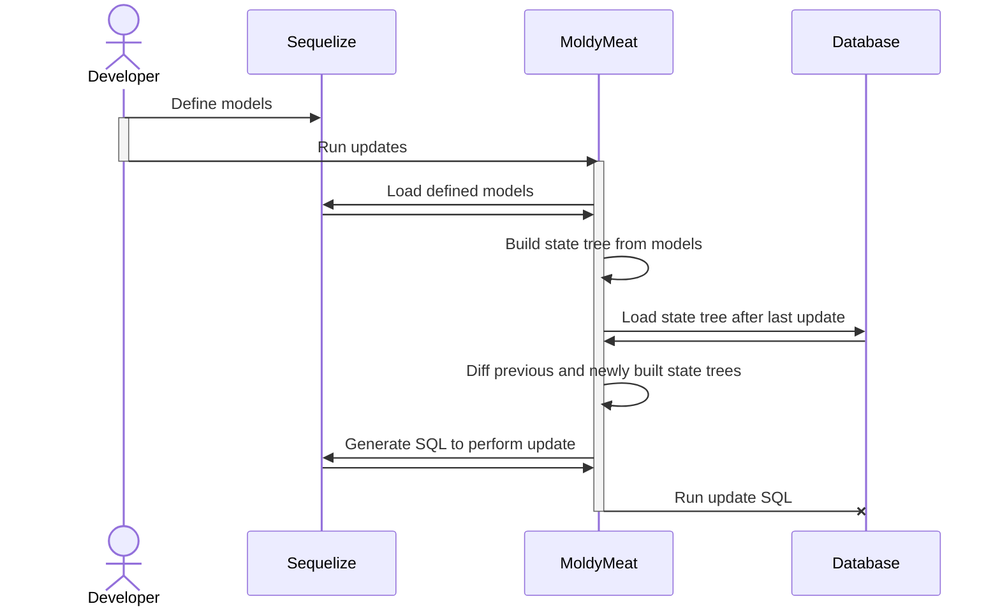

# MoldyMeat

Effortlessly keep your database's tables in sync with your Sequelize models.

Writing database migrations is a waste of time and effort, and even if you generate DB migrations, they're still something of a pain point.

