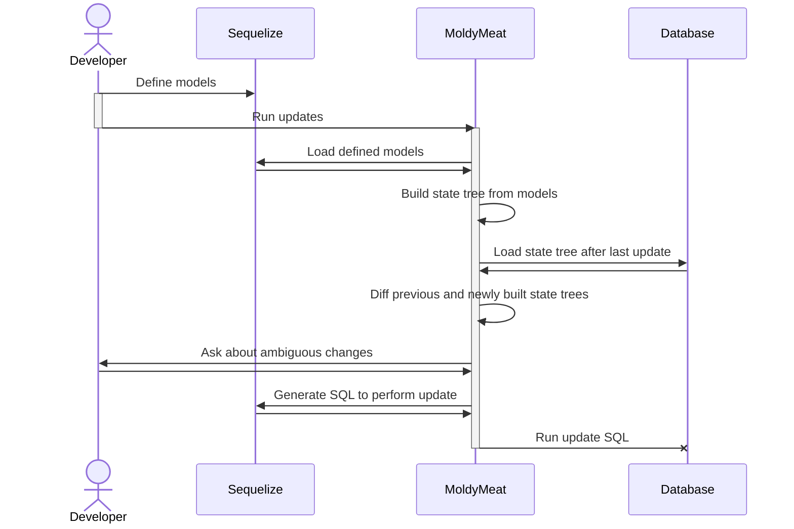

# MoldyMeat

Effortlessly keep your database's tables in sync with your Sequelize models.

## Rationale

Migrations should be a thing of the past. Here's why:

1. They waste programmer-hours to debug when they break
2. Depending on the framework, they have to be hand-written (violating DRY)
3. They can make it difficult for new developers to be onboarded


## Usage

MoldyMeat is a simple library that doesn't take any options and Just Works (tm). Here's how to use it:

```javascript
const sequelize = /* create your Sequelize instance */;

const Model = sequelize.define(...);
const AnotherModel = sequelize.define(...);
// ...more models

const moldyMeat = new MoldyMeat({sequelize});
await moldyMeat.initialize();
await moldyMeat.updateSchema();

// Now, you do that voodoo that you do so well
```

After calling `moldyMeat.updateSchema()`, you are able to use your models as if you had written and ran migrations for them.

## Hints

Unfortunately, there's not a NodeJS framework for reading minds (yet...), so there has to be a way to figure out if you, the developer,
renamed a field, or just removed a field/column/attribute and created a semantically different (but structurally similar) one (or did
something ambiguous like that). ORMs like the one in Django just ask the developer when they generate migrations, so MoldyMeat is
forced to do something similar.

Enter hints.

Hints are the saved responses to questions moldymeat asks when it runs into an ambiguous data model change. They're stored locally, and
are designed to be able to be commited to SCM. They're also designed to be deleteable - Once all databases that need updating have been updated (i.e. you updated production), they can be safely deleted (with those deletions being committed to SCM).

Using hints is as easy as calling updateSchema differently. In a development environment, you would call `updateSchema` with the `generateHints` argument set to `true`:

```javascript
await moldyMeat.updateSchema({generateHints: true});
```

This tells MoldyMeat to generate hints by prompting you, the developer.

In production, you omit the argument:

```javascript
await moldyMeat.updateSchema(); // defaults to generateHints=false, useHints=true
```

To turn off hints completely, set the `useHints` argument to `false`:

```javascript
await moldyMeat.updateSchema({useHints: false}); // defaults to generateHints=false
```

## How MoldyMeat works

Below is a diagram showing what happens when you use MoldyMeat's `updateSchema` method.


